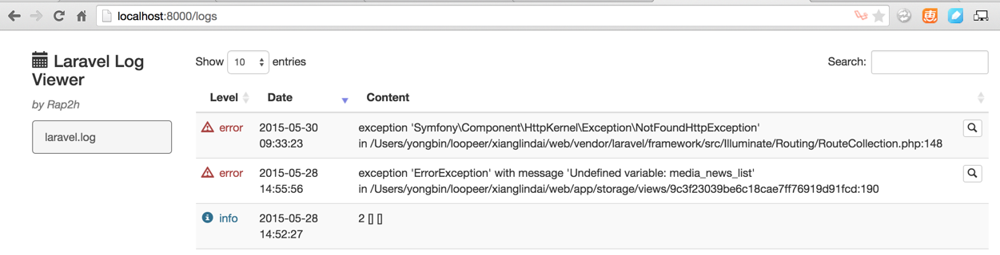

# 第三方插件来源地址：<https://github.com/rap2hpoutre/laravel-log-viewer>
       

# 使用方法：

1.编辑composer.json文件，增加      
`"rap2hpoutre/laravel-log-viewer": "0.2.*"`      
2.编辑config/app.php文件，增加
`'Rap2hpoutre\LaravelLogViewer\LaravelLogViewerServiceProvider',`      
3.编辑route文件，增加      
`Route::get('logs', '\Rap2hpoutre\LaravelLogViewer\LogViewerController@index');`      
4.访问路由，如http://localhost:8000/logs，将显示日志文件内容列表记录      

