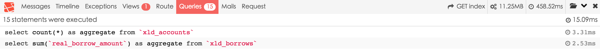

# 第三方插件来源地址：<https://github.com/barryvdh/laravel-debugbar/tree/1.8>
       

# 使用方法：

1.laravel 4.x使用1.8版本，编辑composer.json文件，增加      
`"barryvdh/laravel-debugbar": "~1.8"`      
2.编辑config/local/app.php文件，增加       
`'providers' => array('Barryvdh\Debugbar\ServiceProvider',),`     
`'aliases' => array('Debugbar' => 'Barryvdh\Debugbar\Facade',),`        
3.命令行下，执行               
php artisan config:publish barryvdh/laravel-debugbar            
4.访问路由，如http://localhost:8000/index，页面底部显示工具条      

